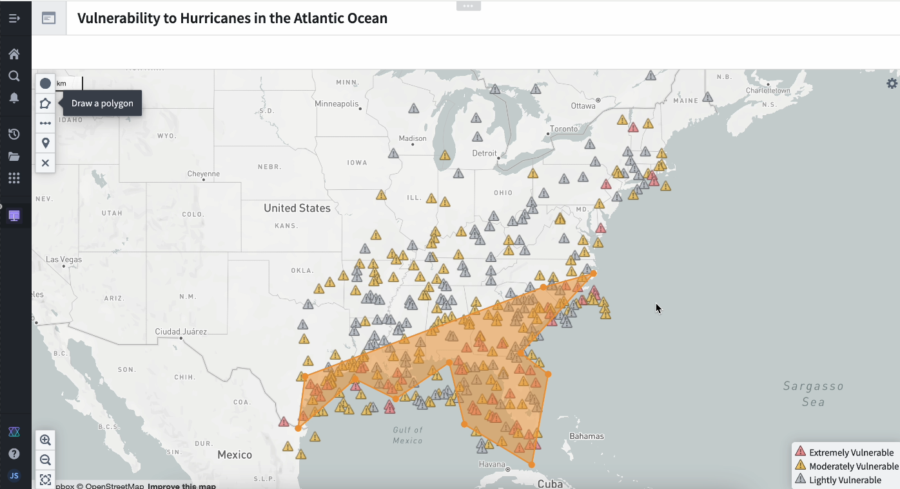
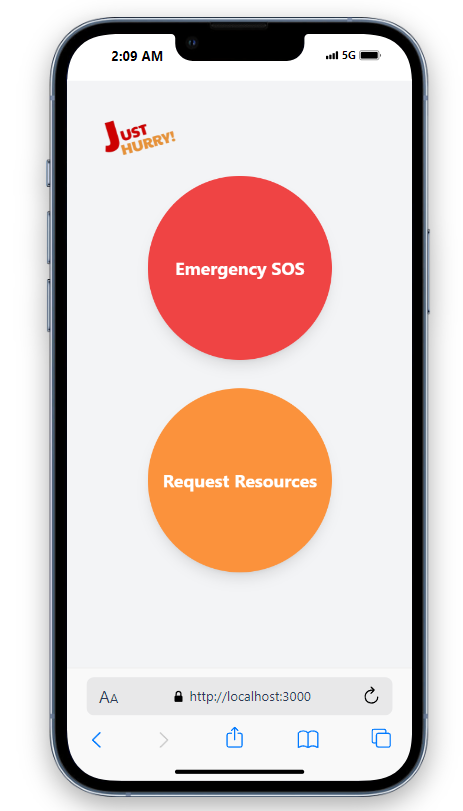
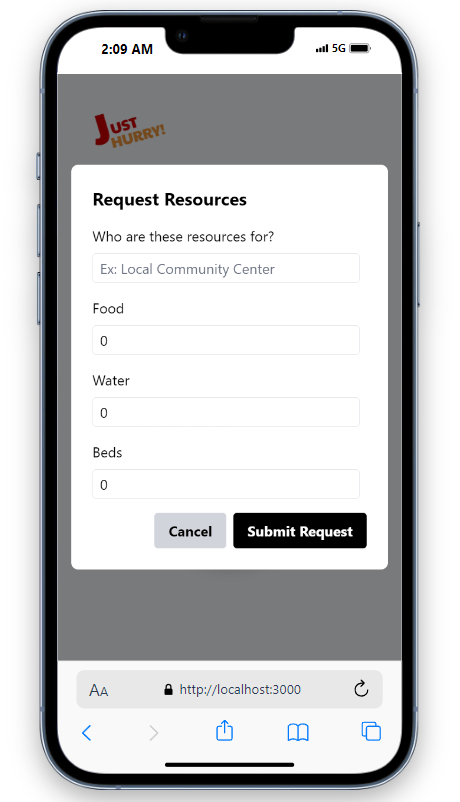
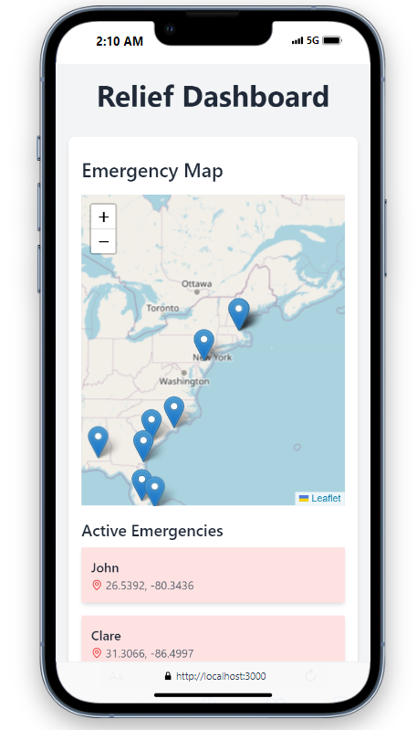
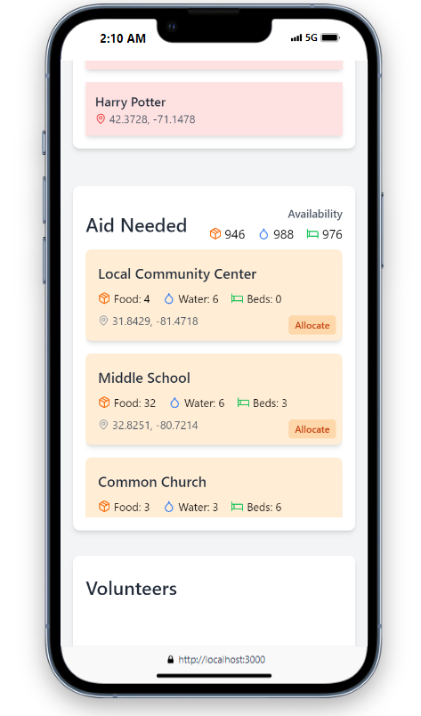

# JustHurry Hurricane Relief Tool
Thousands were left without homes and basic resources in the wake of the devastating hurricanes that tore through Florida recently. We knew we had to dig deeper into this problem. To research this problem, we built an analysis tool using Palantir’s Foundry to pinpoint the areas most at risk of severe hurricane damage. Just then, we found out how slow and inefficient post-disaster relief efforts were. That’s when we realized something had to change. So, we created JustHurry—an intuitive platform built to expedite resource distribution and make sure the most vulnerable communities get the attention they need.

### What is JustHurry
JustHurry is a comprehensive tool that connects those in need with relief organizations ready to provide timely aid 🤝. At its core is a custom ML model 🤖 that calculates a real-time risk factor for communities based on their socioeconomic vulnerability and historical hurricane data. It uses critical variables like air pressure, wind speed, income, and population density  🌬️ to predict impact zones and determine which regions require the most attention 🚨.

### Here’s where JustHurry shines ✨
Organizations can register the resources they have available, from food supplies 🥫 to medical equipment 🏥. Our platform optimally allocates these resources to regions based on real-time user requests, ensuring that those most in need get the help they deserve, faster ⏳. Additionally, with a seamless interface, JustHurry empowers users to request emergency help and volunteer to provide aid 🚑 with just a few clicks.

### Why is JustHurry sustainable?
Traditional hurricane disaster response systems are often inefficient and lead to wasted resources. JustHurry ensures resources are used wisely, minimizing waste and encouraging volunteers to go out and make an impact 🌟. By aligning real-time needs with organizational capabilities, we promote sustainable recovery efforts that reduce environmental impact ♻️, while prioritizing human life.

### Conclusion
JustHurry isn’t just about helping communities recover — it’s about building a resilient system that adapts to the growing severity of natural disasters 🌪️. Our goal is to bring out the best in humanity’s response to nature’s worst! Thank you!

